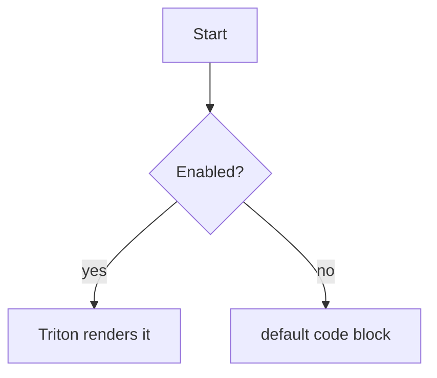

# Triton in Markdown

This file demonstrates embedding Triton diagrams in Markdown. Open it with VS
Code's built-in Markdown preview (the Triton extension must be active), or run
**Triton: Open Preview** with this file focused.

## Inline `triton` block

A ` ```triton ` fenced block is compiled to inline SVG. These are always
handled by the extension:

```triton
flowchart LR
  Source[".triton / .mmd / .md"] --> Compile["render()"]
  Compile --> SVG["inline SVG"]
```

## A tree diagram

```triton
tree
  root
    left
    right
      leaf
```

## Mermaid block (opt-in)

A ` ```mermaid ` block is only rendered by Triton when the
`triton.enableMermaid` setting is enabled (so it never stomps an installed
Mermaid extension):



## File-reference embed

Instead of inlining the source, a block can point at an external diagram file
with a lone `file:` directive. The path is resolved relative to this Markdown
file and restricted to the open workspace:

```triton
file: ../flowchart/flowchart.mmd
```
