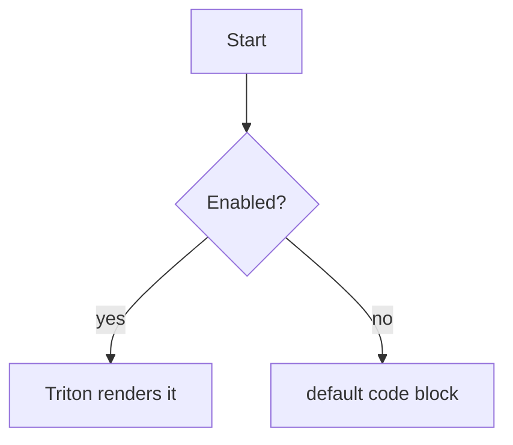

# Triton in Markdown

This file demonstrates embedding Triton diagrams in Markdown. Open it with VS
Code's built-in Markdown preview (the Triton extension must be active), or run
**Triton: Open Preview** with this file focused.

## Inline `triton` block

A ` ```triton ` fenced block is compiled to inline SVG. These are always
handled by the extension:

```triton
flowchart LR
  Source[".triton / .mmd / .md"] --> Compile["render()"]
  Compile --> SVG["inline SVG"]
```

## A tree diagram

```triton
tree
  root
    left
    right
      leaf
```

## Mermaid block (opt-in)

A ` ```mermaid ` block is only rendered by Triton when the
`triton.enableMermaid` setting is enabled (so it never stomps an installed
Mermaid extension):



```triton
flowchart TD
  A[Start] --> B{Enabled?}
  B -->|yes| C[Triton renders it]
  B -->|no| D[default code block]
```


## File-reference embed

Instead of inlining the source, a block can point at an external diagram file
with a lone `file:` directive. The path is resolved relative to this Markdown
file and restricted to the open workspace:

```triton
file: ../flowchart/flowchart.mmd
```

## Poster

```triton
poster "Cell Spanning"
    columns 3

    cell hero "Query plan — spans all 3 columns" [3] :: plan
        plan
            Hash Join {rows: 980}
                Seq Scan orders {rows: 10000}
                Hash
                    Index Scan customers {idx: idx_cust}
    end

    cell idx "B+tree index — spans 2 columns" [2] :: btree
        btree order 3 insert 10 20 30 40 50 60 25 55
    end
    cell kinds "Family" :: stat
        13 | new diagram kinds
    end

    cell arr "Array" :: array
        array 5 8 13 21 34
    end
    cell list "Linked list" :: linkedlist
        linkedlist 3 7 9
    end
    cell bal "AVL tree" :: avl
        avl insert 50 30 70 20 40 60
    end
```

```triton
poster "Row Spanning"
    columns 3

    cell tall "AVL — spans 2 rows" [1x2] :: avl
        avl insert 50 30 70 20 40 60 80 10
    end
    cell up "Uptime" :: stat
        99.9% | uptime
    end
    cell lat "Latency" :: stat
        42ms | p99
    end

    cell arr "Array" :: array
        array 5 8 13 21
    end
    cell list "Linked list" :: linkedlist
        linkedlist 3 7 9
    end
```