# Mermaid Fidelity Review Gallery

> **Visual QA by Ken** — 2026-07-13
>
> This document provides source code and Triton-rendered PNGs for side-by-side comparison against [mermaid.live](https://mermaid.live).

## How to Use

1. Copy the fenced `.mmd` source for a diagram type
2. Paste into [mermaid.live](https://mermaid.live)
3. Open the corresponding Triton PNG (path provided)
4. Walk through the **Fidelity Checklist** comparing both renders
5. Note any deviations in the checkbox items

---

## 1. C4

**Source:** `examples/mermaid/c4/c4.mmd`
**Triton PNG:** `examples/mermaid/c4/c4-ken.png`

```mermaid
---
title: System Context diagram for Internet Banking System
theme: default-c4
---
C4Context
  title System Context diagram for Internet Banking System
  Enterprise_Boundary(b0, "BankBoundary0") {
    Person(customerA, "Banking Customer A", "A customer of the bank, with personal bank accounts.")
    Person(customerB, "Banking Customer B")
    Person_Ext(customerC, "Banking Customer C", "A customer of the bank using an external partner portal.")
    System(SystemAA, "Internet Banking System", "Allows customers to view information about their bank accounts, and make payments.")
    Boundary(b1, "BankBoundary") {
      System(SystemC, "Email System", "The internal Microsoft Exchange e-mail system.")
      System_Ext(SystemE, "Mainframe Banking System", "Stores all of the core banking information about customers, accounts, transactions, etc.")
    }
  }
  Person_Ext(customerD, "Banking Customer D", "A customer of the bank, <br/> with personal bank accounts.")
  System_Ext(SystemF, "Authentication Provider", "The external Authentication Provider, Okta.")
  Rel(customerA, SystemAA, "Uses")
  Rel(customerB, SystemAA, "Uses")
  Rel(customerC, SystemAA, "Uses")
  Rel(SystemAA, SystemC, "Sends e-mails", "SMTP")
  Rel(SystemAA, SystemE, "Uses")
  Rel_Ext(customerD, SystemF, "Authenticate", "REST")
```

### Fidelity Checklist
- [ ] Person shapes rendered with distinctive person icon/silhouette
- [ ] System boxes rendered as rounded rectangles with fill color
- [ ] External systems (System_Ext) use different styling (dashed/gray)
- [ ] Enterprise boundaries shown as dashed container boxes
- [ ] Nested boundaries properly contain child elements
- [ ] Relation arrows connect correct nodes with labels
- [ ] Relation technology labels shown in brackets (e.g., [SMTP])
- [ ] Title appears at top of diagram
- [ ] Color palette matches C4 conventions (blue internal, gray external)

### Ken's Pre-flagged Triton Defects
- Person shapes render as labeled boxes rather than classic person silhouettes — Mermaid uses stick-figure icons
- Internal/external color distinction is present (purple vs white) but palette differs from C4 standard blue

---

## 2. Class

**Source:** `examples/mermaid/class/class.mmd`
**Triton PNG:** `examples/mermaid/class/class-ken.png`

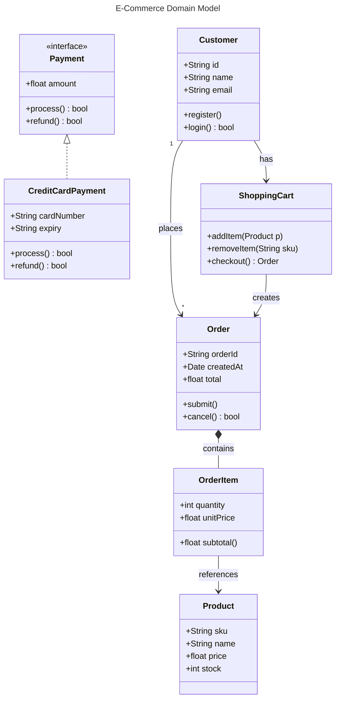

### Fidelity Checklist
- [ ] Class boxes have header with class name
- [ ] Attributes section separated from methods section
- [ ] Visibility modifiers shown (+, -, #)
- [ ] Stereotypes (<<interface>>) displayed above class name
- [ ] Association arrows with labels on relationship line
- [ ] Composition (filled diamond) vs aggregation (hollow diamond)
- [ ] Implementation (dashed line with hollow triangle)
- [ ] Multiplicity labels ("1", "*") positioned at correct ends
- [ ] Return types shown after method names

### Ken's Pre-flagged Triton Defects
- None observed — clean render with all UML notation present

---

## 3. ER

**Source:** `examples/mermaid/er/er.mmd`
**Triton PNG:** `examples/mermaid/er/er-ken.png`

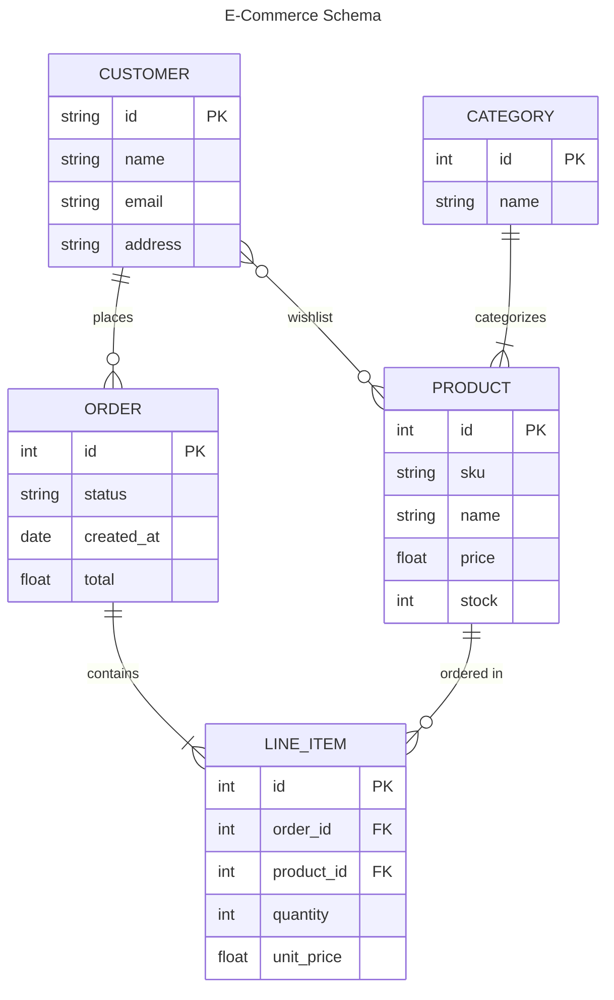

### Fidelity Checklist
- [ ] Entity boxes with entity name header
- [ ] Attributes listed with type and name
- [ ] PK/FK/UK constraint labels shown
- [ ] Crow's-foot notation for cardinality (||, |{, }o, o{)
- [ ] Identifying (solid) vs non-identifying (dashed) relationship lines
- [ ] Relationship labels positioned on lines
- [ ] Zero-or-one (o) vs exactly-one (|) symbols correct
- [ ] Zero-or-many (}o) vs one-or-many (|{) symbols correct

### Ken's Pre-flagged Triton Defects
- None observed — excellent crow's-foot notation rendering

---

## 4. Flowchart

**Source:** `examples/mermaid/flowchart/flowchart.mmd`
**Triton PNG:** `examples/mermaid/flowchart/flowchart-ken.png`

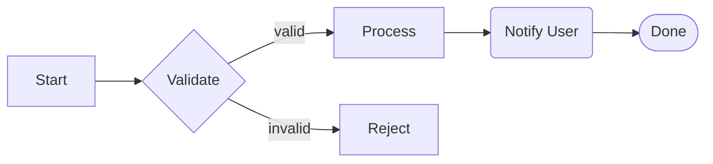

### Fidelity Checklist
- [ ] Direction matches (LR = left-to-right)
- [ ] Rectangle nodes [text] render as rectangles
- [ ] Diamond nodes {text} render as decision diamonds
- [ ] Rounded nodes (text) render with rounded corners
- [ ] Stadium/pill nodes ([text]) render as stadium shape
- [ ] Edge labels displayed on arrows
- [ ] Arrow direction correct (head at target)
- [ ] No edge crossings when avoidable
- [ ] Labels readable and not inside node boxes

### Ken's Pre-flagged Triton Defects
- None observed — clean rectilinear routing

---

## 5. Gantt

**Source:** `examples/mermaid/gantt/gantt.mmd`
**Triton PNG:** `examples/mermaid/gantt/gantt-ken.png`

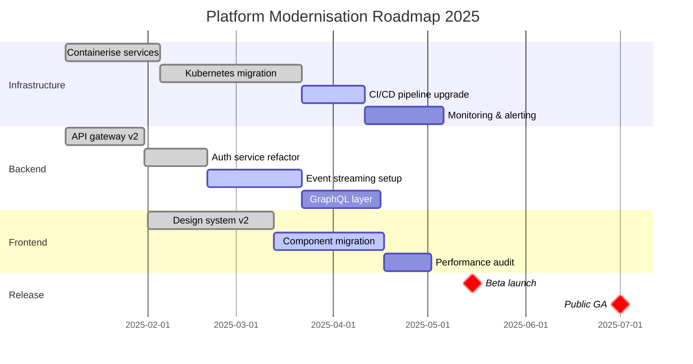

### Fidelity Checklist
- [ ] Title displayed at top
- [ ] Time axis with date labels
- [ ] Section headers grouping tasks
- [ ] Task bars with correct duration/positioning
- [ ] Done tasks styled differently (filled/green)
- [ ] Active tasks styled differently (blue)
- [ ] Future tasks styled differently (unfilled/gray)
- [ ] Critical milestones marked with diamond/special marker
- [ ] Task dependencies (after) reflected in positioning
- [ ] Date format matches specification

### Ken's Pre-flagged Triton Defects
- None observed — excellent gantt rendering with status colors

---

## 6. Gitgraph

**Source:** `examples/mermaid/gitgraph/gitgraph.mmd`
**Triton PNG:** `examples/mermaid/gitgraph/gitgraph-ken.png`

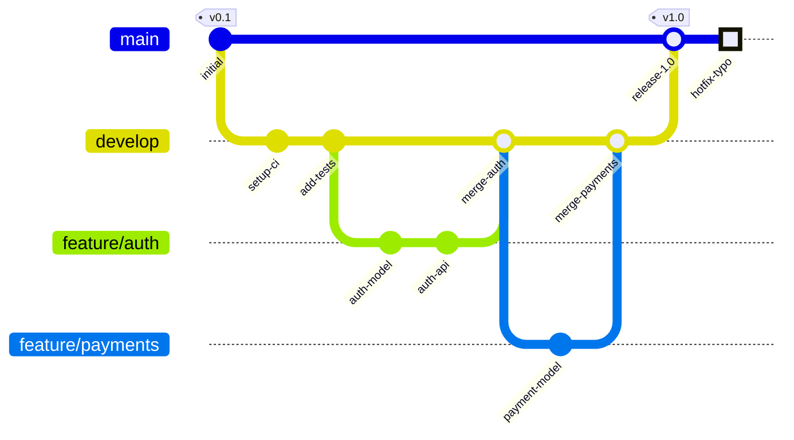

### Fidelity Checklist
- [ ] Branch lanes visually distinct (different colors)
- [ ] Commits shown as circles on branch lines
- [ ] Commit IDs displayed as labels
- [ ] Tags rendered with distinctive tag shape
- [ ] Branch creation shown as lane fork
- [ ] Merge commits connect lanes with merge lines
- [ ] HIGHLIGHT type commits use special styling
- [ ] Branch order reflects creation sequence
- [ ] Merge arrows direction correct (source → target)

### Ken's Pre-flagged Triton Defects
- None observed — excellent branch visualization with tags

---

## 7. Journey

**Source:** `examples/mermaid/journey/journey.mmd`
**Triton PNG:** `examples/mermaid/journey/journey-ken.png`

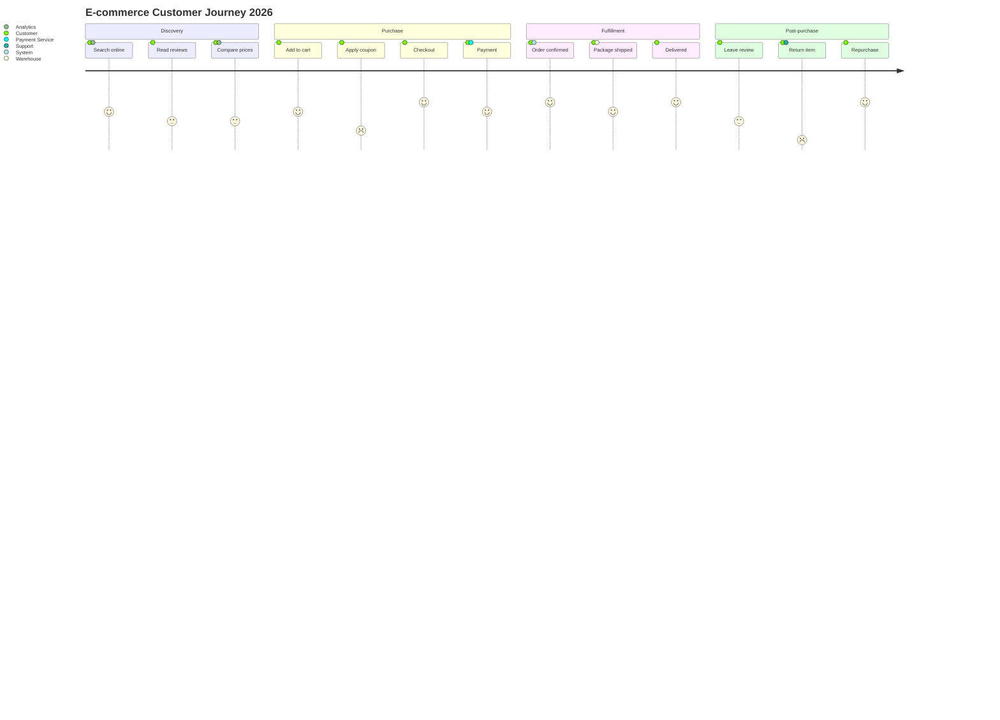

### Fidelity Checklist
- [ ] Title displayed at top
- [ ] Sections shown as labeled groups with colored headers
- [ ] Score values (1-5) reflected in line height/position
- [ ] Task labels displayed below score points
- [ ] Actors listed below each task
- [ ] Connected line shows score progression
- [ ] Score circles/markers at each task
- [ ] Color coding reflects satisfaction (low=red, high=green)
- [ ] Section boundaries visually distinct

### Ken's Pre-flagged Triton Defects
- None observed — clear score visualization with sections

---

## 8. Kanban

**Source:** `examples/mermaid/kanban/kanban.mmd`
**Triton PNG:** `examples/mermaid/kanban/kanban-ken.png`

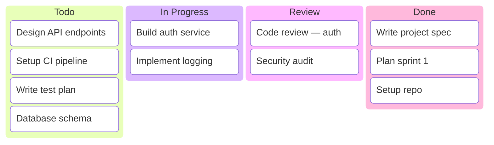

### Fidelity Checklist
- [ ] Columns arranged horizontally
- [ ] Column headers with distinct styling
- [ ] Card count shown in column header
- [ ] Cards displayed as rectangles within columns
- [ ] Card text readable and not truncated
- [ ] Column colors differentiated
- [ ] Cards vertically stacked within columns
- [ ] Column boundaries clear

### Ken's Pre-flagged Triton Defects
- None observed — clean kanban with card counts in headers

---

## 9. Mindmap

**Source:** `examples/mermaid/mindmap/mindmap.mmd`
**Triton PNG:** `examples/mermaid/mindmap/mindmap-ken.png`

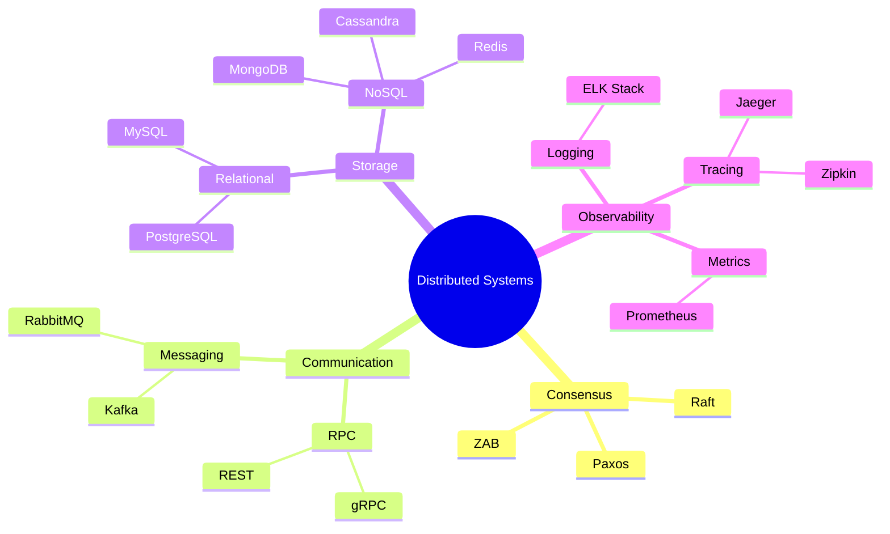

### Fidelity Checklist
- [ ] Root node centered or at origin
- [ ] Child branches radiate outward
- [ ] Node shapes vary by depth (circle, rounded, rect)
- [ ] Branch colors differentiated
- [ ] Icons (::icon) displayed next to nodes
- [ ] Hierarchical indentation reflected in layout
- [ ] Labels readable at all levels
- [ ] No overlapping nodes
- [ ] Title displayed

### Ken's Pre-flagged Triton Defects
- Icon markers appear as small dots rather than Font Awesome icons — likely a deliberate placeholder

---

## 10. Pie

**Source:** `examples/mermaid/pie/languages.mmd`
**Triton PNG:** `examples/mermaid/pie/languages-ken.png`

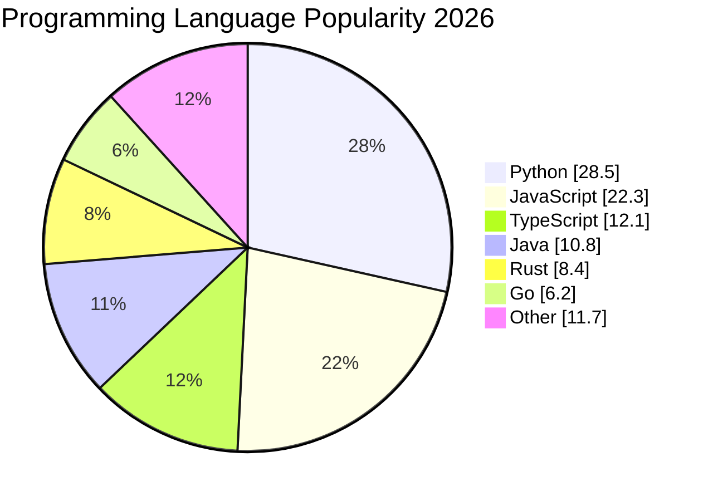

### Fidelity Checklist
- [ ] Title displayed at top
- [ ] Circular pie chart rendered
- [ ] Wedges proportional to values
- [ ] Percentage labels inside wedges
- [ ] Legend with label, value, and percentage
- [ ] Distinct colors for each wedge
- [ ] showData values appear in legend
- [ ] Wedge boundaries clearly defined

### Ken's Pre-flagged Triton Defects
- None observed — excellent pie with legend

---

## 11. Quadrant

**Source:** `examples/mermaid/quadrant/quadrant.mmd`
**Triton PNG:** `examples/mermaid/quadrant/quadrant-ken.png`

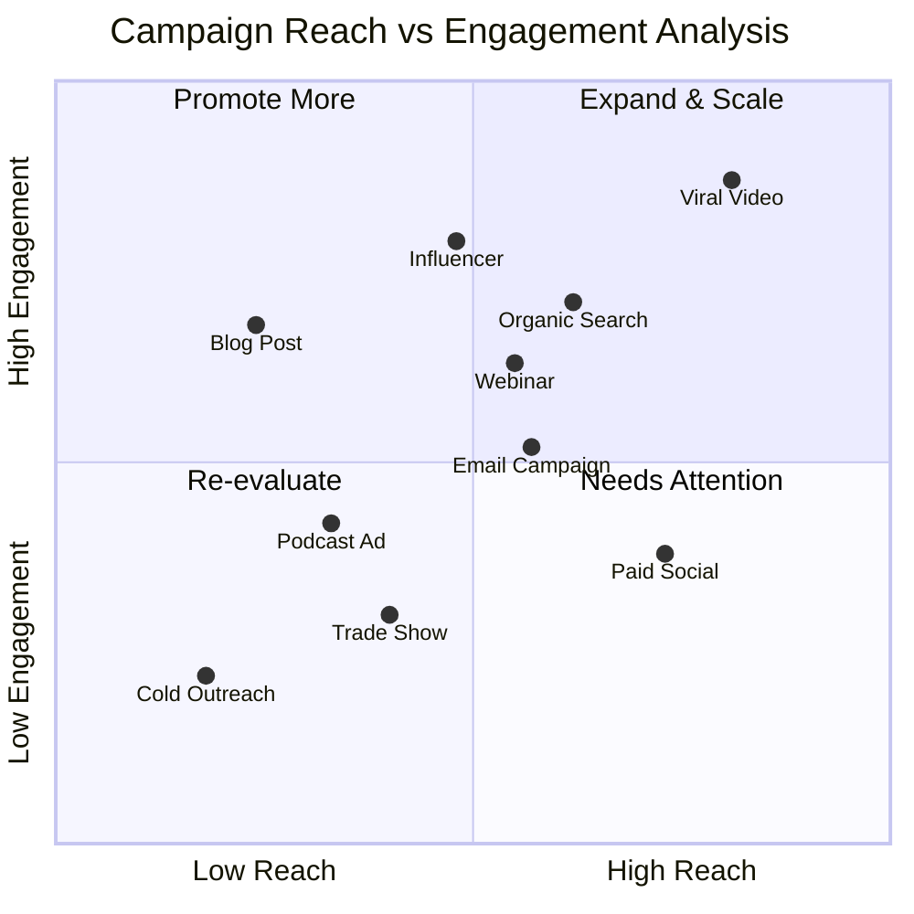

### Fidelity Checklist
- [ ] Title displayed at top
- [ ] Four quadrants with distinct colors
- [ ] Quadrant labels positioned correctly (1=top-right, 2=top-left, 3=bottom-left, 4=bottom-right clockwise)
- [ ] X-axis labels (low → high) displayed
- [ ] Y-axis labels (low → high) displayed
- [ ] Data points positioned by [x, y] coordinates
- [ ] Data point labels displayed
- [ ] Axis divider lines at 0.5 position
- [ ] Points styled as circles/dots

### Ken's Pre-flagged Triton Defects
- None observed — clean quadrant chart

---

## 12. Radar

**Source:** `examples/mermaid/radar/radar.mmd`
**Triton PNG:** `examples/mermaid/radar/radar-ken.png`

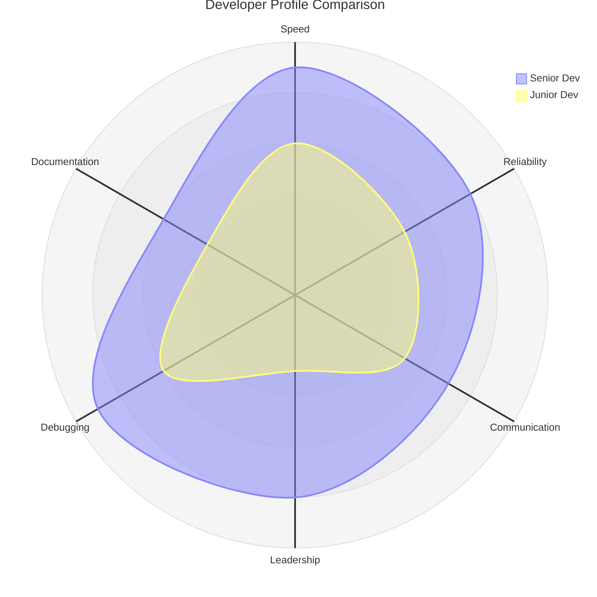

### Fidelity Checklist
- [ ] Title displayed at top
- [ ] Hexagonal (6-axis) grid structure
- [ ] Axis labels around perimeter
- [ ] Multiple curves overlaid
- [ ] Curve legend with labels
- [ ] Fill areas for each curve
- [ ] Grid rings at interval values
- [ ] Axis spokes from center to perimeter
- [ ] Min/max values respected

### Ken's Pre-flagged Triton Defects
- None observed — clean radar chart

---

## 13. Requirement

**Source:** `examples/mermaid/requirement/requirement.mmd`
**Triton PNG:** `examples/mermaid/requirement/requirement-ken.png`

```mermaid
requirementDiagram

requirement UserAuthentication {
id: REQ-001
text: The system shall authenticate users via username and password with MFA support.
risk: high
verifymethod: test
}

functionalRequirement AuditLogging {
id: REQ-002
text: All access events shall be logged with timestamp and user identity.
risk: medium
verifymethod: analysis
}

designConstraint DataRetention {
id: CON-001
text: Audit logs must be retained for a minimum of 90 days.
risk: low
verifymethod: inspection
}

element AuthService {
type: microservice
docref: docs/auth-service.md
}

element AuditDatabase {
type: datastore
docref: docs/audit-db.md
}

AuthService - satisfies -> UserAuthentication
AuthService - contains -> AuditLogging
AuditDatabase - refines -> DataRetention
AuditLogging - derives -> DataRetention
```

### Fidelity Checklist
- [ ] Requirement blocks with stereotype labels
- [ ] Block properties (id, text, risk, verifymethod) displayed
- [ ] Element blocks with type and docref
- [ ] Relation arrows with type labels (satisfies, contains, derives, refines)
- [ ] Dashed vs solid lines for different relation types
- [ ] Arrow direction correct (from - type -> to)
- [ ] Block borders distinguish requirement types
- [ ] Text wrapping within blocks

### Ken's Pre-flagged Triton Defects
- None observed — stereotypes and relations render correctly

---

## 14. Sankey

**Source:** `examples/mermaid/sankey/sankey.mmd`
**Triton PNG:** `examples/mermaid/sankey/sankey-ken.png`

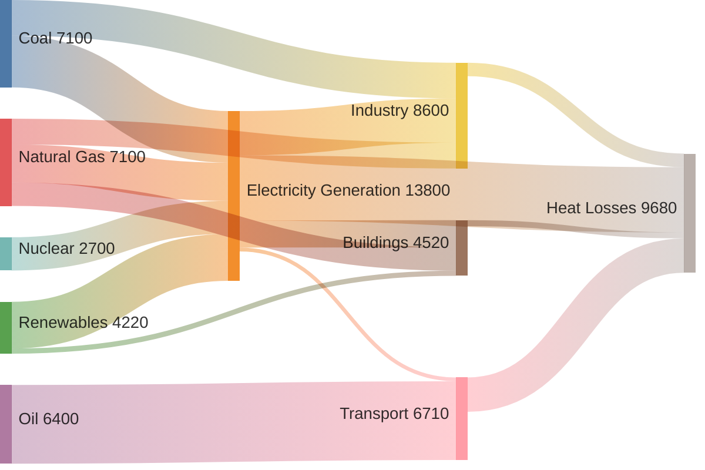

### Fidelity Checklist
- [ ] Source nodes on left side
- [ ] Target nodes on right side
- [ ] Flow ribbons connect sources to targets
- [ ] Ribbon width proportional to value
- [ ] Node labels displayed
- [ ] Multi-stage flow (source → intermediate → sink)
- [ ] Flow colors differentiated by source
- [ ] No ribbon crossings when avoidable
- [ ] Node heights proportional to total flow

### Ken's Pre-flagged Triton Defects
- None observed — excellent flow proportions

---

## 15. Sequence

**Source:** `examples/mermaid/sequence/auth.mmd`
**Triton PNG:** `examples/mermaid/sequence/auth-ken.png`

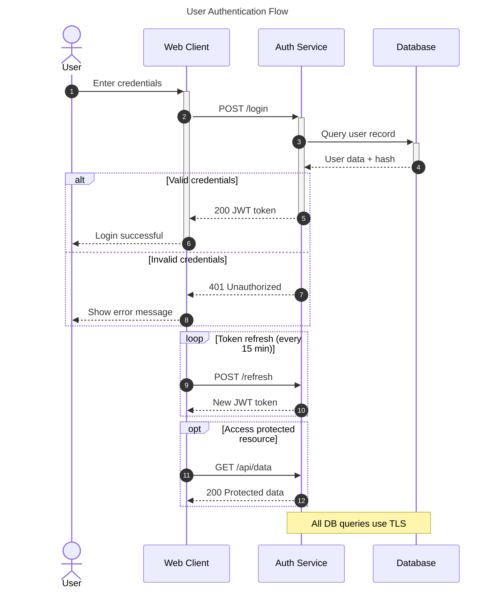

### Fidelity Checklist
- [ ] Title displayed at top
- [ ] Actor icons vs participant boxes
- [ ] Lifelines (dashed vertical lines)
- [ ] Activation bars on lifelines
- [ ] Solid arrows (->>) vs dashed arrows (-->>)
- [ ] Autonumbering on message labels
- [ ] ALT/ELSE fragment boxes with condition labels
- [ ] LOOP fragment with condition
- [ ] OPT fragment with condition
- [ ] Note boxes spanning participants

### Ken's Pre-flagged Triton Defects
- None observed — excellent fragment rendering

---

## 16. State

**Source:** `examples/mermaid/state/state.mmd`
**Triton PNG:** `examples/mermaid/state/state-ken.png`

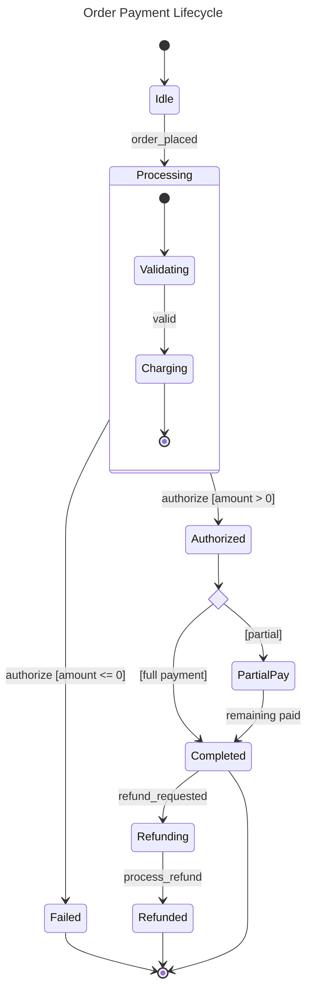

### Fidelity Checklist
- [ ] Title displayed at top
- [ ] States rendered as rounded rectangles
- [ ] Start marker [*] as filled circle
- [ ] End marker [*] as bullseye (circle with dot)
- [ ] Composite state with nested states
- [ ] Choice pseudo-state as diamond
- [ ] Transition arrows with event labels
- [ ] Guard conditions in brackets [condition]
- [ ] Transition labels positioned on arrows

### Ken's Pre-flagged Triton Defects
- Transition label "order_placed" appears truncated near the Processing composite state border — text partially overlaps the boundary

---

## 17. Timeline

**Source:** `examples/mermaid/timeline/timeline.mmd`
**Triton PNG:** `examples/mermaid/timeline/timeline-ken.png`

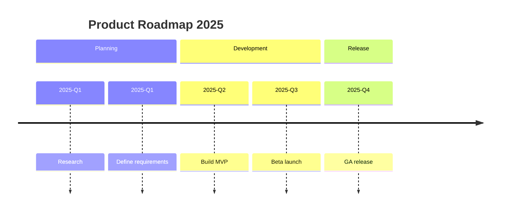

### Fidelity Checklist
- [ ] Title displayed at top
- [ ] Sections as labeled columns
- [ ] Time periods (2025-Q1, etc.) as row headers or markers
- [ ] Events listed under time periods
- [ ] Visual timeline axis
- [ ] Section colors differentiated
- [ ] Events grouped by date
- [ ] Chronological ordering

### Ken's Pre-flagged Triton Defects
- **Simplified layout** — Triton renders timeline as a column-based card view rather than a horizontal time axis with markers; Mermaid typically shows a linear timeline with events plotted along a date axis

---

## 18. XY Chart

**Source:** `examples/mermaid/xychart/xychart.mmd`
**Triton PNG:** `examples/mermaid/xychart/xychart-ken.png`

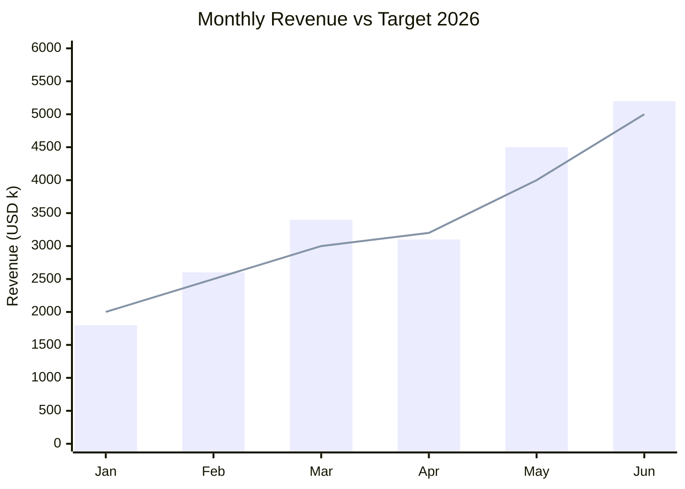

### Fidelity Checklist
- [ ] Title displayed at top
- [ ] X-axis with category labels
- [ ] Y-axis with numeric scale and label
- [ ] Bar series rendered as vertical bars
- [ ] Line series rendered as connected points
- [ ] Bar and line overlaid correctly
- [ ] Y-axis range (0 → 6000) respected
- [ ] Grid lines visible
- [ ] Data values positioned correctly

### Ken's Pre-flagged Triton Defects
- None observed — clean bar+line overlay

---

## 19. Architecture

**Source:** `examples/mermaid/architecture/architecture.mmd`
**Triton PNG:** `examples/mermaid/architecture/architecture-ken.png`

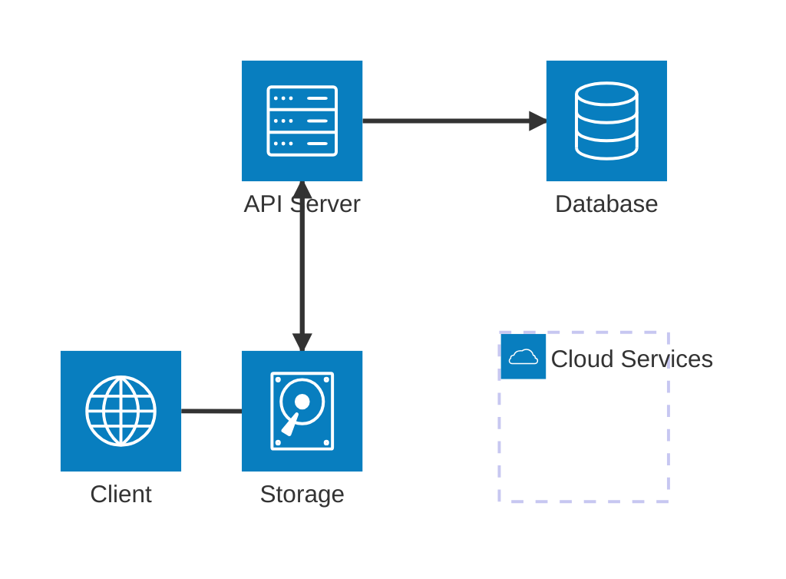

### Fidelity Checklist
- [ ] Groups rendered as container boxes
- [ ] Services rendered with icons
- [ ] Icon types (cloud, server, database, internet, disk) correct
- [ ] Service labels displayed
- [ ] Directed edges with arrowheads
- [ ] Edge routing respects port specifications (R, L, T, B)
- [ ] Group labels displayed
- [ ] Services positioned within groups
- [ ] Edge directions match specification (--> vs --)

### Ken's Pre-flagged Triton Defects
- Edge from Client to API Server has non-optimal routing — goes down then right rather than a cleaner horizontal-then-vertical path

---

## Cross-cutting Gaps

Issues observed across multiple diagram types, ranked by severity:

### High Severity
1. **Timeline layout divergence** — Timeline renders as a card-based column view rather than a horizontal time axis with date markers. This is a fundamental layout difference from mermaid.live.

### Medium Severity
2. **C4 Person shapes** — Person nodes render as labeled boxes rather than classic stick-figure silhouettes used in Mermaid's C4 implementation. Functional but visually different.

3. **Icon rendering in Mindmap** — Font Awesome icons (::icon directive) render as small colored dots rather than actual icon glyphs. This is likely intentional (avoiding external font dependencies) but loses icon semantics.

### Low Severity
4. **State diagram label truncation** — Long transition labels near composite state boundaries may get truncated or overlap the boundary stroke.

5. **Architecture edge routing** — Some edge paths use suboptimal routing that could be improved (extra bends when a simpler path exists).

6. **Color palette variations** — Some diagram types (C4, sequence) use a different color palette than Mermaid's defaults. Functionally equivalent but visually distinct.

---

## Summary

| Type | Status | Notes |
|------|--------|-------|
| c4 | ⚠️ | Person shapes differ |
| class | ✅ | Clean render |
| er | ✅ | Excellent crow's-foot |
| flowchart | ✅ | Clean render |
| gantt | ✅ | Status colors present |
| gitgraph | ✅ | Branches + tags clean |
| journey | ✅ | Score visualization clean |
| kanban | ✅ | Card counts present |
| mindmap | ⚠️ | Icons as dots |
| pie | ✅ | Legend complete |
| quadrant | ✅ | Clean render |
| radar | ✅ | Multi-curve overlay |
| requirement | ✅ | Stereotypes render |
| sankey | ✅ | Flow proportions correct |
| sequence | ✅ | Fragments excellent |
| state | ⚠️ | Label truncation |
| timeline | ❌ | Layout divergence |
| xychart | ✅ | Bar+line overlay |
| architecture | ⚠️ | Edge routing |

**Legend:** ✅ = Pass | ⚠️ = Minor issues | ❌ = Significant divergence

---

## Architecture-beta Grid Layout Re-Review

> **Visual QA by Ken** — 2026-07-13T21:52:00-04:00
>
> Re-review after Brian replaced the layout engine with BFS grid placer (`gridPlacer.ts`).
> Previous round FAILED align-grid due to B/D overlap. This round verifies the fix.

### 1. architecture.svg — **PASS** ✅

Baseline architecture renders correctly with proper grid placement:
- ✅ Group "Cloud Services" contains API Server + Database (top row inside group)
- ✅ Storage bottom-left, Client bottom-right (outside group)
- ✅ Edge routing: `client:R → B:api` vertical down-then-across, `api:R → L:db` horizontal, `api:B → T:storage` vertical
- ✅ All arrowheads axis-aligned
- ✅ No node overlaps
- ✅ Labels readable

### 2. arrows.svg — **PASS** ✅

All 4 arrow forms render correctly in horizontal row:
- ✅ `--` (Alpha–Beta): no arrowheads — correct
- ✅ `-->` (Beta→Gamma): right arrowhead only — correct
- ✅ `<--` (Gamma←Delta): left arrowhead only — correct
- ✅ `<-->` (Delta↔Epsilon): both arrowheads — correct
- ✅ All edges rectilinear, arrowheads axis-aligned

### 3. junctions.svg — **PASS** ✅

4-way junction renders correctly:
- ✅ Junction dot visible at center split point
- ✅ Left → Junction with arrowhead
- ✅ Junction splits to Top (up), Right (right), Bottom (down)
- ✅ Clean edge meets at junction, no crossings through unrelated nodes
- ✅ All arrowheads axis-aligned

### 4. group-edges.svg — **PASS** ✅

{group} edge modifier works:
- ✅ Group A contains Service A1 + Service A2
- ✅ Group B (nested) contains Service B1
- ✅ Edge from A1 → B1 routes correctly
- ✅ Horizontal edge from B1 exits right of Group A boundary, loops around to A2
- ✅ No node overlap, group boundaries distinct

### 5. nested-groups.svg — **PASS** ✅

Nested group containment renders correctly:
- ✅ Cloud (outer purple) contains Backend + Data groups
- ✅ Backend (teal) contains API + Cache
- ✅ Data (orange) contains Database
- ✅ Client outside all groups, connects to API
- ✅ API → Cache horizontal, API → Database vertical
- ✅ Clear visual hierarchy with proper padding
- ✅ No box overlaps

### 6. align-grid.svg — **PASS** ✅ (FIXED!)

**The B/D overlap defect from last round is FIXED.**

SVG coordinates confirm proper 2×2 grid:
```
A: x=24,  y=24   (top-left, purple)
B: x=244, y=24   (top-right, teal)
C: x=24,  y=124  (bottom-left, orange)
D: x=244, y=124  (bottom-right, indigo)
```

Visual verification:
- ✅ A and B share same Y (row-aligned) ✓
- ✅ C and D share same Y (row-aligned) ✓
- ✅ A and C share same X (column-aligned) ✓
- ✅ B and D share same X (column-aligned) ✓
- ✅ All 4 nodes distinctly visible at separate positions
- ✅ Edges: A→B horizontal, A→C vertical, B→D vertical, C→D horizontal
- ✅ No overlapping node boxes

### Summary Table

| Example | Verdict | Notes |
|---------|---------|-------|
| architecture.svg | ✅ PASS | Grid placement correct |
| arrows.svg | ✅ PASS | All 4 arrow forms correct |
| junctions.svg | ✅ PASS | 4-way junction clean |
| group-edges.svg | ✅ PASS | {group} boundary attachment works |
| nested-groups.svg | ✅ PASS | Nested containment correct |
| align-grid.svg | ✅ PASS | **B/D overlap FIXED** |

**Overall Grid Layout verdict: 6/6 PASS**

The new BFS grid placer in `gridPlacer.ts` correctly implements directional side semantics. The critical align-grid overlap bug from the previous Sugiyama-based layout is resolved.
